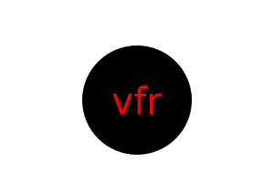

# SVG Logo Maker

## Description

This command-line application dynamically generates a logo and save it as an SVG file from a user's input. This application is created using javascript, npm package manager, node.js and jest testing framework.  The application prompts the user to select a shape, provide text, text color and shape color for the logo and save the generated SVG to a .svg file. It also makes sure that the added text is not more than 3 characters long and the colors are valid .This is done with the help of the packages 'inquirer-maxlength-input-prompt' and 'is-valid-css-color'. The command line interface is built using inquirer.js. The logo is generated using SVG markup which is created using javascript template literals and written to a .svg file using fs module.

## Installation

- Install Node.js v16 
- Clone the Repository from GitHub
- Install  necessary dependencies running the following command :

  ```
  npm i 
  ```

## Usage

The application can be invoked by using the following command:

  ```
  node index.js  
  ```

OR

  ```
  npm start
  ```

The user is prompted to select text, text color, shape and shape color of the logo when the application is run . The length of the text is restricted to 3 characters. If the user enters a text which is more than 3 characters then a message will be displayed saying 'Input contains too many characters!'.The text color and shape color can be either a color keyword or a hexadecimal number. When the user is prompted to select a shape for the logo, then a list of shapes (Circle, Triangle and Square) will be displayed to choose a shape from.  After input for all the prompts are entered a success message will be displayed and a logo.svg file will be generated in the folder 'examples'.

#### Link to walkthrough video :

https://drive.google.com/file/d/12_N9_cSRhxjUMt3nRA10MNYB6Awc101r/view?usp=sharing


The following image shows the application's appearance and functionality :

[](https://drive.google.com/file/d/12_N9_cSRhxjUMt3nRA10MNYB6Awc101r/view?usp=sharing)

#### Link to generated logo :

https://github.com/shimna-puthanayil/get-my-logo/blob/main/examples/logo.svg

#### Generated logo.svg



#### Examples of logos generated:

https://github.com/shimna-puthanayil/get-my-logo/tree/main/examples

## Credits

#### References

http://cs.wellesley.edu/~cs204/readings/OOP2/

https://www.npmjs.com/package/inquirer

https://www.npmjs.com/package/is-valid-css-color

https://www.npmjs.com/package/inquirer-maxlength-input-prompt

https://archive.jestjs.io/docs/en/24.x/expect#tothrowerror

https://archive.jestjs.io/docs/en/24.x/expect

https://developer.mozilla.org/en-US/docs/Web/SVG/Tutorial/Getting_Started

https://developer.mozilla.org/en-US/docs/Web/SVG/Tutorial/Basic_Shapes

## License

[MIT](https://opensource.org/licenses/MIT) license.

 ## Tests

  To run tests, run the following command :

  ```
  npm test
  ```
